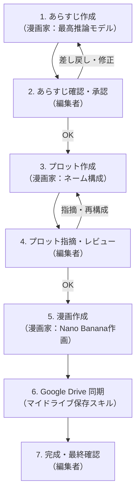

# comic-creator

AI（漫画家）とユーザー（編集者）が協働して漫画を制作するためのAIエージェント制作環境です。
段階的な制作ワークフロー（あらすじ → プロット → 原稿作成）と、**Nano Banana** を活用した漫画画像生成、および **Google Drive（マイドライブ）** への自動保存機能を備えています。

---

## 1. 役割分担 (Roles)

| 役割 | 担当 | 主な責任・アクション |
| :--- | :--- | :--- |
| **漫画家** | AI (Agent) | ・企画・あらすじの立案（最高推論モデルを活用）<br>・プロット（コマ割り・構図・セリフ）の作成<br>・編集者の指摘に対するブラッシュアップ<br>・Nano Banana による漫画画像の生成<br>・原稿データの管理 |
| **編集者** | ユーザー (User) | ・作品のテーマ・方向性の提示<br>・各フェーズ（あらすじ・プロット）の合否判定・承認<br>・演出やセリフ、テンポに対する具体的な指摘・修正指示<br>・最終クオリティの確認 |

---

## 2. 制作ワークフロー (Workflow)

各フェーズは編集者の承認（合意）を得てから次のステップへ進む厳密なフローを採用しています。



### 進行ステップ
1. **あらすじ作成（漫画家）**: テーマや要件からログライン・起承転結を考案。
2. **あらすじ確認（編集者）**: 編集者が内容をチェックし、OKまたはブラッシュアップ指示。
3. **プロット作成（漫画家）**: 承認されたあらすじからコマ割り・セリフ・構図を詳細化。
4. **指摘・レビュー（編集者）**: 演出・テンポ・フキダシ配置への指摘と反映。
5. **漫画作成（漫画家）**: Nano Banana を使用し、キャラクター一貫性を保って作画。
6. **Google Drive 保存**: 完成原稿をマイドライブへ自動同期。
7. **最終確認（編集者）**: 全体の仕上がりを確認して完成。

---

## 3. ディレクトリ構成 (Directory Structure)

```text
comic-creator/
├── AGENTS.md                          # 制作ワークフロー・役割規約
├── README.md                          # プロジェクトドキュメント（本ファイル）
├── requirements.txt                   # Python依存関係
├── .env                               # 環境設定（Googleアカウント・接続情報等）
├── .env.example                       # 環境設定テンプレート
├── setting/                           # 設定資料
│   ├── characters/                    # キャラクターリスト・特徴・Nano Banana用固定プロンプト
│   │   └── template.md
│   └── world/                         # 世界観・地理背景・舞台設定
│       └── template.md
├── summery/                           # あらすじ格納ディレクトリ
│   └── {話数}/{バージョン}/          # 例: summery/ep01/v1/synopsis.md
├── plot/                              # プロット格納ディレクトリ
│   └── {話数}/{バージョン}/          # 例: plot/ep01/v1/plot.md
├── manuscripts/                       # Nano Banana 作画画像・原稿データ
│   └── {話数}/{バージョン}/          # 例: manuscripts/ep01/v1/page_01_panel_01.png
├── scripts/                           # ユーティリティスクリプト
│   └── upload_to_gdrive.py            # Google Drive マイドライブ保存スクリプト
└── .gemini/skills/                    # 専用スキル群
    ├── synopsis-designer/             # あらすじ考案スキル (最高推論モデル)
    ├── plot-architect/                # プロット作成スキル
    ├── nano-banana-artist/            # Nano Banana 原稿作成スキル
    └── manuscript-drive-exporter/     # 原稿 Google Drive 保存スキル
```

---

## 4. 搭載スキル一覧 (Custom Skills)

プロジェクト配下の `.gemini/skills/` に以下の専用スキルを整備しています：

1. **`synopsis-designer`（あらすじ考案）**
   - 推論性能の高いモデル（Proモデル）や深い思考（Deep Thinking）を活用し、ログライン・動機・葛藤・起承転結・引き（フック）を多角的に検証してあらすじを作成。
2. **`plot-architect`（プロット作成）**
   - 設定資料とあらすじを基に、コマ割り・カメラアングル・構図・セリフ・ト書き・オノマトペを詳細に設計。
3. **`nano-banana-artist`（Nano Banana 作画・原稿作成）**
   - キャラクターシートの固定プロンプトを適用して外見の一貫性を保ち、コマごとの Nano Banana 画像生成およびプロンプトログ（`prompts.md`）を管理。
4. **`manuscript-drive-exporter`（原稿 Google Drive 保存）**
   - 作成された原稿ディレクトリを Google Drive のマイドライブへ自動アップロード。

---

## 5. セットアップ & Google Drive 連携

### 5.1 仮想環境の準備
```bash
python3 -m venv .venv
.venv/bin/pip install -r requirements.txt
```

### 5.2 環境変数設定 (`.env`)
プロジェクト直下の `.env` に Google アカウントおよび Google Drive 接続情報を設定します：

```env
# Google Drive Configuration
GOOGLE_ACCOUNT=yophfrid04@outlook.jp
GOOGLE_DRIVE_ROOT_FOLDER=comic-trainer

# Google Drive API 接続情報 (.env だけで動かす場合は以下を入力)
GOOGLE_CLIENT_ID=xxxxxxxxxxxx.apps.googleusercontent.com
GOOGLE_CLIENT_SECRET=GOCSPX-xxxxxxxxxxxx
```

> **Note**: `GOOGLE_CLIENT_ID` と `GOOGLE_CLIENT_SECRET` は、[Google Cloud Console](https://console.cloud.google.com/) の「認証情報」から「OAuth クライアント ID（デスクトップ アプリ）」を作成することで取得できます。

### 5.3 Google Drive へのアップロード実行
```bash
# 基本実行（話数・バージョン指定）
.venv/bin/python scripts/upload_to_gdrive.py manuscripts/ep01/v1

# オプション指定
.venv/bin/python scripts/upload_to_gdrive.py --episode ep01 --version v1
```
Google Drive のマイドライブ直下に `comic-trainer/manuscripts/{話数}/{バージョン}/` が自動作成され、原稿ファイルが同期されます。
